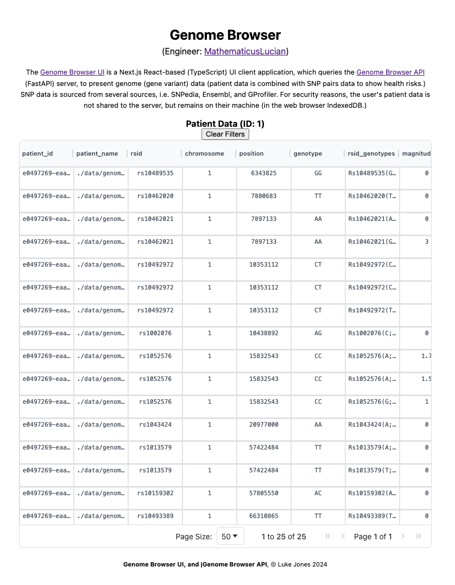

# Genome-Browser-UI

## Overview

The Genome Browser UI is a **React**-based (TypeScript) UI client application (with **NextJs**), and which queries the Genome Browser API to present genome (gene variant) data (patient data is combined with SNP pairs data to show health risks.) SNP data is sourced from several sources, i.e. SNPedia, Ensembl, and GProfiler. For security reasons, the user's patient data is not shared to the server, but remains on their machine (in the web browser **IndexedDB**.)

### Objectives

1. Comparison of ancestry website DNA report with SNPedia data. The major/minor alleles of gene variants, their associated gene, chromosome position, etc..

2. This also serves to demonstrate:

- A _React_ implementation (with **NexrtJs**)
- **REST**ful and **WebSocket** connections for real-time, low-latency communication.
- Consideration of DRY/SOLID principles, and Gang of Four design patterns
- **IndexedDB**: For security reasons, the user's patient data is not shared to the server, but remains on their machine (in the web browser IndexDB.)

## Getting Started

npm run dev
Starts the development server.

npm run build
Builds the app for production.

npm start
Runs the built app in production mode.
