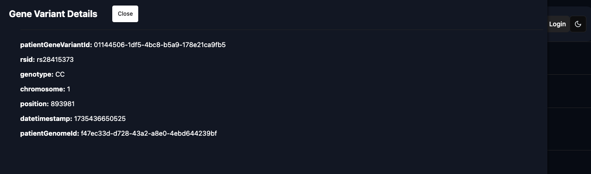

# Genome-Browser-UI 🔬🧬

## Overview

The Genome Browser scans/analyses DNA files from popular family tree providers (23andMe, Ancestry.com, etc.), comparing the genome of the user with published literature on health risks/conditions that their gene variants are correlated to. SNP data is sourced from several sources, i.e. SNPedia, Ensembl, and GProfiler.

For security reasons, the user's patient data is not shared to the server, but remains on their machine (in the web browser **IndexedDB**.)

- This repo is the **React**-based (TypeScript) UI client application (with **NextJs**), and which queries the Genome Browser API.
- The API/Orchestrator for this project is here: [Genome Browser API](https://github.com/MathematicusLucian/Genome-Browser-API).

### Objectives

1. Comparison of ancestry website DNA report with SNPedia data. The major/minor alleles of gene variants, their associated gene, chromosome position, etc..

2. This also serves to demonstrate:

- A _React_ implementation (with **NexrtJs**)
- **REST**ful and **WebSocket** connections for real-time, low-latency communication.
- React Context and Providers
- Consideration of DRY/SOLID principles, and Gang of Four design patterns
- **IndexedDB**: For security reasons, the user's patient data is not shared to the server, but remains on their machine (in the web browser IndexDB.)

## Pages/Views

### Open the DNA (VCF) test file, i.e display gene variants (SNPs)

The rows represent the gene variants associated with the patient. (The `rsid` columns is the identifier for the SNP pairs; and a crucial factor in many cases, with respect to risk, is the `genotype` that the user has inherited from their parents - hence, generaly, this consists of two letters, i.e. one from each parent.)


### Health Risk/Correlation Report

The report compares the gene variants of the patient with published literature to indiciate which of their respective SNPs are associated with health conditions.


If you click on a row, the app will launch a drawer featuring the details for the gene variant.



### List of Patients

Patient genomes that the user has uploaded.


## UI Client Architecture

The Genome Browser UI leverages the powerful features of Next.js to build a robust and scalable web application. Below is an overview of the key architectural components and patterns used in this project.

### Key Features

1. **File-based Routing**: Next.js uses a file-based routing system, where each file in the `pages` directory corresponds to a route in the application. This simplifies the creation and management of routes.

2. **Dynamic Routing**: Dynamic routes are created using square brackets in the file names, allowing for the creation of routes with parameters. For example, `pages/patient/[patient_id].tsx` handles routes like `/patient/1`.

3. **API Routes**: Next.js allows the creation of API endpoints within the `pages/api` directory. These endpoints can be used to handle server-side logic and interact with external APIs or databases.

4. **Static Generation (SSG)**: Next.js supports static generation, allowing pages to be pre-rendered at build time. This improves performance and SEO. The `getStaticProps` and `getStaticPaths` functions are used to fetch data and generate static pages.

5. **Server-side Rendering (SSR)**: For pages that require dynamic data fetching at request time, Next.js supports server-side rendering. The `getServerSideProps` function is used to fetch data on each request.

6. **Client-side Rendering**: Next.js also supports client-side rendering for interactive pages. The `useEffect` hook is used to fetch data on the client side after the initial render.

7. **API Integration**: The application integrates with the Genome Browser API to fetch genome data. API calls are made using the `fetch` API within `getStaticProps`, `getServerSideProps`, or `useEffect` depending on the rendering strategy.

8. **State Management**: React's `useState` and `useEffect` hooks are used for managing local component state and side effects. For more complex state management, libraries like Redux or Context API can be integrated.

### Directory Structure

The project follows a structured directory layout to organize the codebase efficiently:

- `/api`
- `/components`
  - `Layout.tsx`: [Layout component for consistent page structure]
  - `TableGrid.tsx`: [Component for displaying data in a table grid]
  - etc.
- `/pages`: Routes/Views
  - `/api`: [API routes for server-side logic]
    - etc.
  - `/patient`: [[...params]].tsx [Dynamic route for patient data]
    - etc.
  - `_app.tsx`: [Custom App component]
  - `index.tsx`: [Home page]
- `/public`: [Static assets like images, icons, etc.]
- `/services`: [Service functions for API calls and business logic]
- `/styles`: [CSS and SCSS files for styling]
- `/utils`: [Utility functions and helpers]

## Getting Started

- `npm run dev`: Starts the development server. Browse to `http://127.0.0.1:3000/`.
- `npm run build`: Builds the app for production.
- `npm start`: Runs the built app in production mode.

### Environment Variables

**Locally**:
Set up the environment variables:

```bash
cp .env.example .env
```

**Environment Variables on Vercel**:
`vercel env pull`

## IndexedDB


[Chrome Offline Storage](https://developer.chrome.com/docs/apps/offline_storage/)

```shell
navigator.webkitPersistentStorage.queryUsageAndQuota (
    function(usedBytes, grantedBytes) {
        console.log('we are using ', usedBytes, ' of ', grantedBytes, 'bytes');
    },
    function(e) { console.log('Error', e);  }
);
```

or
`'indexedDB' in window` in the Chrome Dev Tools' Console.

Request memory increase:

```shell
var requestedBytes = 1024*1024*280;
navigator.webkitPersistentStorage.requestQuota (
    requestedBytes, function(grantedBytes) {
        console.log('we were granted ', grantedBytes, 'bytes');

    }, function(e) { console.log('Error', e); }
);
```
