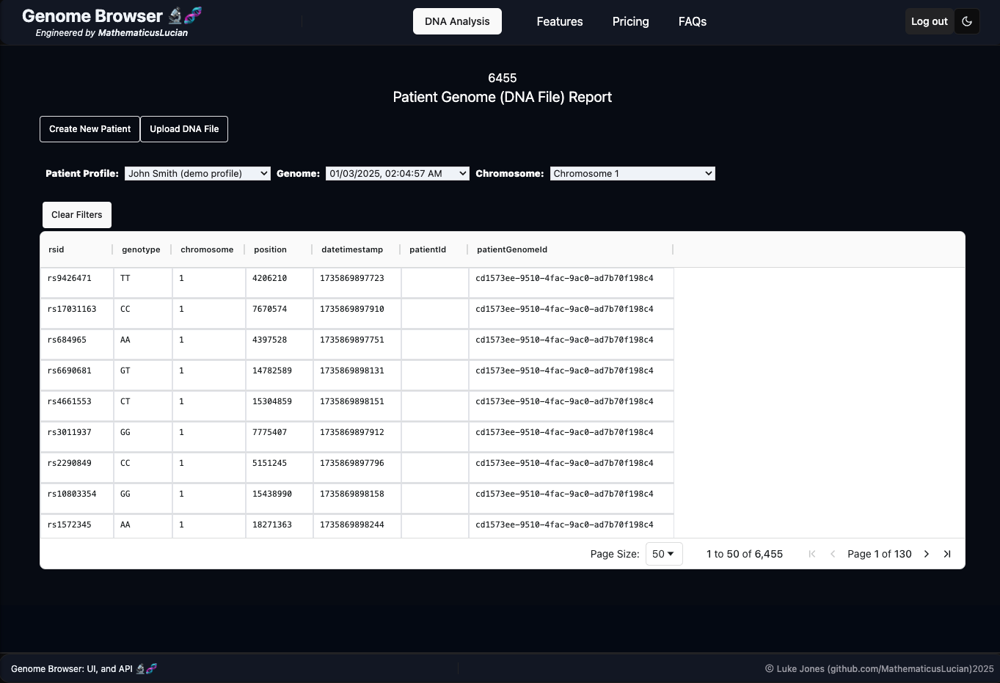
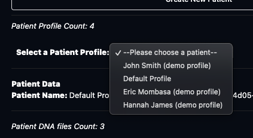
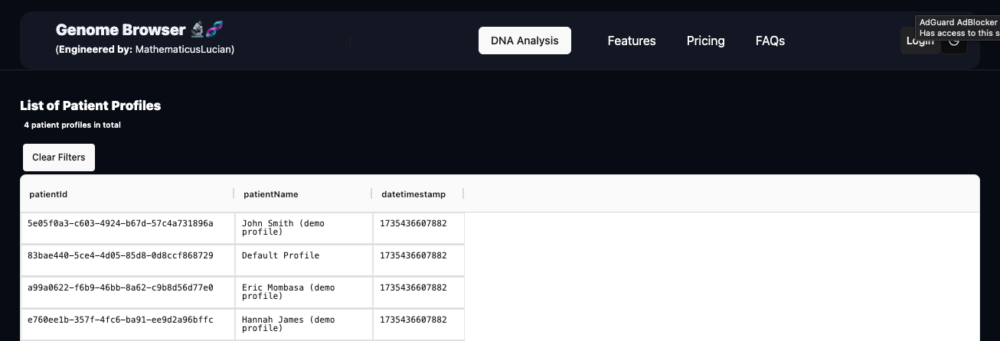
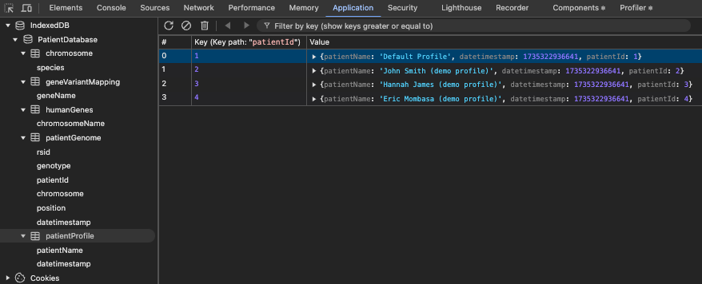

# Genome-Browser-UI 🔬🧬

## Overview

The Genome Browser scans/analyses DNA files from popular family tree providers (23andMe, Ancestry.com, etc.), comparing the genome of the user with published literature on health risks/conditions that their [gene variants](https://en.wikipedia.org/wiki/Human_genetic_variation) are correlated to. SNP data is sourced from several sources, i.e. SNPedia, Ensembl, and GProfiler.

For security reasons, the user's patient data is not shared to the server, but remains on their machine (in the web browser **IndexedDB**.) The SNP data from published literature is provisioned by the server.

- This repo is the **React**-based (TypeScript) UI client application (with **NextJs**), and which queries the Genome Browser API.
- The API/Orchestrator for this project is here: [Genome Browser API](https://github.com/MathematicusLucian/Genome-Browser-API).

### Objectives

DNA files from popular family tree providers (23andMe, Ancestry.com, etc.) are long text files that lack meaning (unless someone had memorised SNP ids, and the associated published literature.)

1. A dashboard UI (grids/tables, charts, etc.) to browse DNA files. Present the major/minor alleles of gene variants, their associated gene, chromosome position, etc..

2. **Long-term**: Cronjob to trigger Python script to download and parse weekly VCF releases of CIViC and ClinVar data, and upload such to a Postgres database. Separate tables will be generated for genome builds [GRCh37](https://www.ncbi.nlm.nih.gov/datasets/genome/GCF_000001405.13/) and [GRCh38](https://www.ncbi.nlm.nih.gov/datasets/genome/GCF_000001405.26/) (Genome Reference Consortium Human genome builds 37, and 38; also known as hg38; these builds relate to the [1000 genome project](https://www.internationalgenome.org/human-genome-structural-variation-consortium/)), as well as for mono-allelic variants and complex multi-allelic variants. Rhe tables will be augmented with allele frequencies from the ExAC and gnomAD datasets as these are often consulted when analyzing ClinVar variants.


3. Compare the DNA file to published literature, i.e. generate a report of the potential health conditions/risks associated with the gene varients that the patient's genome features.

**This also serves to demonstrate:**

- A _React_ implementation (with **NexrtJs**)
- **REST**ful and **WebSocket** connections for real-time, low-latency communication.
- **React Provider**/**Context**, e.g. Dark/Light mode
- Consideration of DRY/SOLID principles, and Gang of Four design patterns
- **IndexedDB**: For security reasons, the user's patient data is not shared to the server, but remains on their machine (in the web browser `IndexedDB`.) (See section below on `Dexie.js`, etc..)
- **shadncn/ui**

## Pages/Views

### Upload a DNA test results (VCF) file


If a patient file does not exist, the user is prompted to create one (the default name is `Default Profile`.)

The patient software allows for the upload of several DNA files per patient, as they potentially could have several such as files, as there are many popular family tree providers (23andMe, Ancestry.com, etc..)

### Browse gene variants (SNPs) present in the patient genome

**The rows represent the gene variants associated with the patient.**

(The `rsid` columns is the identifier for the SNP pairs; and a crucial factor in many cases, with respect to risk, is the `genotype` that the user has inherited from their parents - hence, generaly, this consists of two letters, i.e. one from each parent.)



Dark/light mode available:


From the dropdown, the user can select which profile to view:



### Health Risk/Correlation Report

The report compares the gene variants of the patient with published literature to indiciate which of their respective SNPs are associated with health conditions.


If a user clicks on a row, the app will launch a drawer featuring the details for the gene variant.


### List of Patients

Patient genomes that the user has uploaded.



## UI Client Architecture

The Genome Browser UI leverages the powerful features of Next.js to build a robust and scalable web application. Below is an overview of the key architectural components and patterns used in this project.

### Key Features

1. **File-based Routing**: Next.js uses a file-based routing system, where each file in the `pages` directory corresponds to a route in the application. This simplifies the creation and management of routes.

2. **Dynamic Routing**: Dynamic routes are created using square brackets in the file names, allowing for the creation of routes with parameters. For example, `pages/patient/[patient_id].tsx` handles routes like `/patient/1`.

3. **API Routes**: Next.js allows the creation of API endpoints within the `pages/api` directory. These endpoints can be used to handle server-side logic and interact with external APIs or databases.

4. **Static Generation (SSG)**: Next.js supports static generation, allowing pages to be pre-rendered at build time. This improves performance and SEO. The `getStaticProps` and `getStaticPaths` functions are used to fetch data and generate static pages.

5. **Server-side Rendering (SSR)**: For pages that require dynamic data fetching at request time, Next.js supports server-side rendering. The `getServerSideProps` function is used to fetch data on each request.

6. **Client-side Rendering**: Next.js also supports client-side rendering for interactive pages. The `useEffect` hook is used to fetch data on the client side after the initial render.

7. **API Integration**: The application integrates with the Genome Browser API to fetch genome data. API calls are made using the `fetch` API within `getStaticProps`, `getServerSideProps`, or `useEffect` depending on the rendering strategy.

8. **State Management**: React's `useState` and `useEffect` hooks are used for managing local component state and side effects. For more complex state management, libraries like Redux or Context API can be integrated.

### Directory Structure

The project follows a structured directory layout to organise the codebase efficiently:

- `/api`
- `/components`
  - `Layout.tsx`: [Layout component for consistent page structure]
  - `TableGrid.tsx`: [Component for displaying data in a table grid]
  - etc.
- `/context`
- `/database`
- `/models`
- `/pages`: Routes/Views
  - `/api`: [API routes for server-side logic]
    - etc.
  - `/patient`: [[...params]].tsx [Dynamic route for patient data]
    - etc.
  - `_app.tsx`: [Custom App component]
  - `index.tsx`: [Home page]
- `/providers`
- `/public`: [Static assets like images, icons, etc.]
- `/services`: [Service functions for API calls and business logic]
- `/state`
- `/styles`: [CSS and SCSS files for styling]
- `/types`
- `/utils`: [Utility functions and helpers]

## Getting Started

- `npm run dev`: Starts the development server. Browse to `http://127.0.0.1:3000/`.
- `npm run build`: Builds the app for production.
- `npm start`: Runs the built app in production mode.

### Environment Variables

**Locally**:
Set up the environment variables:

```bash
cp .env.example .env
```

**Environment Variables on Vercel**:
`vercel env pull`

## IndexedDB


### Dexie,js

Relative to the `IndexedDB` native API, the [`Dexie.js`](https://dexie.org/) wrapper (a promise-based API) provides simplicity and ease of interaction (for TypeScript/JavaScript apps.) It is a clean and efficient way to manage IndexedDB with `Dexie.js` in a `React` and `Next.js` environment.

**Dexie.js Schema**: The `chromosomeName` is defined as the primary key of the object store, ensuring that if a record with the same chromosomeName already exists, it won't be inserted again.

**Database Name**: `patientsIndexedDb`



**Demo data**:

- To populate tables, e.g. chromosomes, patient profiles, patient genomes/gene varients, etc., if empty. Before adding new data, we check if the table already contains any records using `count`, e.g. `patientsIndexedDb.chromosome.count()`. If the count is 0, that means no records exist and we proceed with adding the data.
- The function `addChromosomesIfNotExist` is called inside a `useEffect` hook, ensuring that the check and insertion happen when the component is loaded. This allows performance of a database update when the page is initialized, but this can also be triggered as the action following any React app event.
  ```shell
  useEffect(() => {
    addChromosomesIfNotExist();
  }, []
  ```
- **Versioning and Object Store Creation:** The first time the app is run, the object store will be created, i.e. `patientsIndexedDb.version(1).stores`. If the object store already exists (i.e., it's the same version), it won't be recreated.
- **Efficient Checks**: Instead of directly checking the presence of the table, this method checks if the table is empty by counting existing records. This ensures that the `bulkPut` operation only happens if the table is empty.

**Other**:

- **Schema Upgrades:** When you upgrade the schema (e.g., by increasing the version number in `patientsIndexedDb.version(...)`), the onupgradeneeded event is triggered, allowing you to modify the schema (e.g., adding or modifying object stores/indexes).
- **Overwriting Records**: If there is a unique key such as `chromosomeName` as the primary key, calling `bulkPut` will overwrite any existing record with the same key. This means if you have a row with `chromosomeName: 'Chromosome 1'` already in the table, calling `bulkPut` with the same `chromosomeName` will update the existing record rather than creating a duplicate.
- **Error Handling**: Any errors in adding chromosomes are caught in the catch block and logged to the console.

### Chrome local storage memory

[Chrome Offline Storage](https://developer.chrome.com/docs/apps/offline_storage/)

```shell
navigator.webkitPersistentStorage.queryUsageAndQuota (
    function(usedBytes, grantedBytes) {
        console.log('we are using ', usedBytes, ' of ', grantedBytes, 'bytes');
    },
    function(e) { console.log('Error', e);  }
);
```

or
`'indexedDB' in window` in the Chrome Dev Tools' Console.

Request memory increase:

```shell
var requestedBytes = 1024*1024*280;
navigator.webkitPersistentStorage.requestQuota (
    requestedBytes, function(grantedBytes) {
        console.log('we were granted ', grantedBytes, 'bytes');

    }, function(e) { console.log('Error', e); }
);
```
